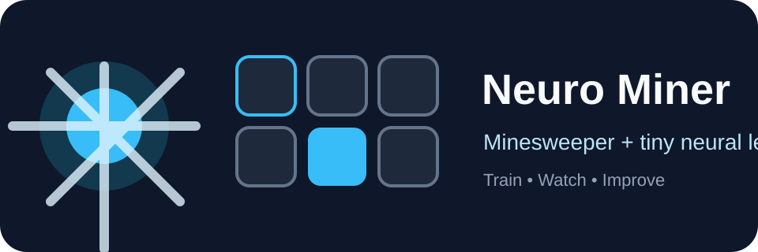

<p align="center">
  
</p>

<h1 align="center">💣 Neuro Miner</h1>

<p align="center">
  <b>Игра «Сапёр», в которую учится играть маленькая нейросеть.</b><br />
  Minesweeper environment + reinforcement learning agent + pure Python neural network.
</p>

<p align="center">
  <a href="https://github.com/festor1233/testGPT/actions"></a>
  
  
  
</p>

---

## ✨ Что внутри

- 🎮 **Полноценная логика Minesweeper**: поле, мины, безопасный первый ход, flood reveal, флаги и рендер в терминал.
- 🧠 **Мини-нейросеть без тяжёлых зависимостей**: one-hidden-layer MLP на чистом Python.
- 🕹️ **RL-агент**: выбирает клетки через value-функцию, исследует поле и учится на наградах.
- 📊 **CLI-тренировка**: быстрый запуск обучения, сохранение модели в JSON.
- 👀 **Просмотр игры агента**: можно увидеть, как обученная модель проходит поле.
- ✅ **Тесты и GitHub Actions**: проект уже готов к поддержке и развитию.

## 🚀 Быстрый старт

```bash
git clone https://github.com/festor1233/testGPT.git
cd testGPT
python -m pip install -e . pytest
```

Запустить тесты:

```bash
pytest -q
```

Обучить агента:

```bash
python -m neuro_miner.train --episodes 1000 --output models/neuro-miner.json
```

Посмотреть, как нейросеть играет:

```bash
python -m neuro_miner.play --model models/neuro-miner.json --delay 0.08
```

Или через установленные команды:

```bash
neuro-miner-train --episodes 1000
neuro-miner-play --model models/neuro-miner.json
```

## 🧩 Как нейросеть принимает решения

Для каждой закрытой клетки агент строит признаки:

| Признак | Зачем нужен |
|---|---|
| Координаты клетки | Помогают модели различать позиции на поле |
| Скрытые соседи | Оценка локальной неопределённости |
| Флаги рядом | Косвенная подсказка о минах |
| Открытые соседи | Насколько клетка уже информативна |
| Сумма чисел вокруг | Чем выше, тем вероятнее риск |
| Доля скрытого поля | Понимание стадии игры |
| Плотность мин | Общий уровень сложности |

Модель предсказывает ценность клика по клетке. Агент берёт лучший вариант, но иногда делает случайный ход — это exploration, без которого обучение застревает.

## 🏗️ Структура проекта

```text
.
├── assets/logo.svg              # Красивый баннер для GitHub
├── src/neuro_miner/
│   ├── game.py                  # Движок Minesweeper
│   ├── model.py                 # TinyMLP на чистом Python
│   ├── agent.py                 # RL-агент
│   ├── train.py                 # CLI для обучения
│   └── play.py                  # CLI для просмотра игры
├── tests/                       # Unit-тесты
├── .github/workflows/ci.yml     # CI для GitHub Actions
├── pyproject.toml               # Метаданные Python-пакета
└── README.md                    # Оформление проекта
```

## 🎯 Roadmap

- [ ] Добавить web-интерфейс с визуализацией поля.
- [ ] Сравнить TinyMLP с Q-table baseline.
- [ ] Добавить графики win-rate по эпохам.
- [ ] Поддержать разные уровни сложности: beginner, intermediate, expert.
- [ ] Добавить сохранение истории ходов и replay.

## 🧪 Пример результата тренировки

```text
episode=    1 win_rate=0.000 epsilon=0.350 avg_moves=4.0 loss=1.245
episode=   50 win_rate=0.080 epsilon=0.274 avg_moves=12.7 loss=0.331
episode=  500 win_rate=0.210 epsilon=0.040 avg_moves=27.6 loss=0.114
saved model -> models/neuro-miner.json
```

> Это учебный проект: модель компактная и быстрая, поэтому её легко читать, менять и улучшать.

## 🤝 Как развивать

1. Измените признаки в `game.py` → `cell_features`.
2. Поменяйте архитектуру в `model.py`.
3. Настройте награды в `game.py` и `agent.py`.
4. Запустите `pytest -q`, затем новую тренировку.

## 📄 Лицензия

MIT — можно свободно использовать, менять и развивать.
